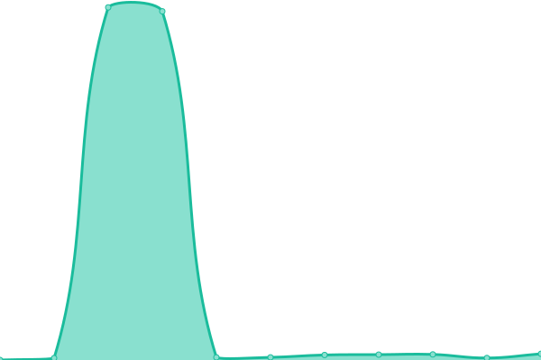
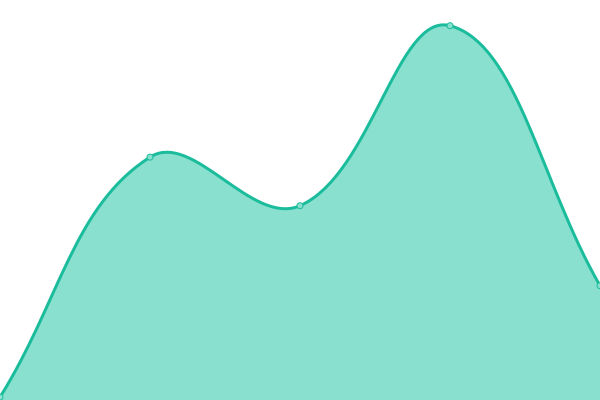
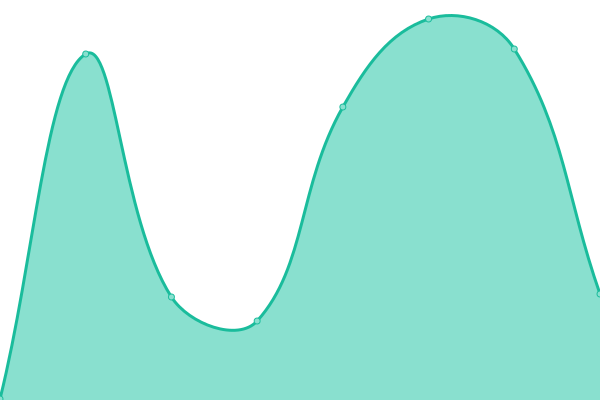
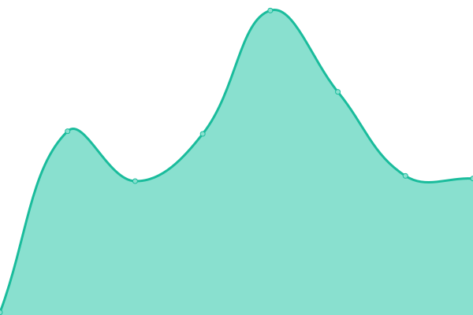

# [📈 Live Status](https://status.taskmesh.co): <!--live status--> **🟧 Partial outage**

This repository contains the open-source uptime monitor and status page for [MBarc](https://status.taskmesh.co), powered by [Upptime](https://github.com/upptime/upptime).

With [Upptime](https://upptime.js.org), you can get your own unlimited and free uptime monitor and status page, powered entirely by a GitHub repository. We use [Issues](https://github.com/MBarc/TaskMesh-Status/issues) as incident reports, [Actions](https://github.com/MBarc/TaskMesh-Status/actions) as uptime monitors, and [Pages](https://status.taskmesh.co) for the status page.

<!--start: status pages-->
<!-- This summary is generated by Upptime (https://github.com/upptime/upptime) -->
<!-- Do not edit this manually, your changes will be overwritten -->
<!-- prettier-ignore -->
| URL | Status | History | Response Time | Uptime |
| --- | ------ | ------- | ------------- | ------ |
|  [Website](https://taskmesh.co) | 🟥 Down | [website.yml](https://github.com/MBarc/TaskMesh-Status/commits/HEAD/history/website.yml) | 

 4070ms
     
 | 

<a href="https://status.taskmesh.co/history/website">99.17%</a>
    

|  [Marketplace](https://taskmesh.co/marketplace) | 🟥 Down | [marketplace.yml](https://github.com/MBarc/TaskMesh-Status/commits/HEAD/history/marketplace.yml) | 

 97ms
     
 | 

<a href="https://status.taskmesh.co/history/marketplace">0.00%</a>
    

|  [Billing](https://stripe.com) | 🟩 Up | [billing.yml](https://github.com/MBarc/TaskMesh-Status/commits/HEAD/history/billing.yml) | 

 220ms
     
 | 

<a href="https://status.taskmesh.co/history/billing">100.00%</a>
    

|  [Discord Community](https://discord.com/api/v10/gateway) | 🟩 Up | [discord-community.yml](https://github.com/MBarc/TaskMesh-Status/commits/HEAD/history/discord-community.yml) | 

 65ms
     
 | 

<a href="https://status.taskmesh.co/history/discord-community">100.00%</a>
    

<!--end: status pages-->

[**Visit our status website →**](https://status.taskmesh.co)

## 📄 License

- Powered by: [Upptime](https://github.com/upptime/upptime)
- Code: [MIT](./LICENSE) © [Anand Chowdhary](https://anandchowdhary.com), supported by [Pabio](https://pabio.com)
- Data in the `./history` directory: [Open Database License](https://opendatacommons.org/licenses/odbl/1-0/)
